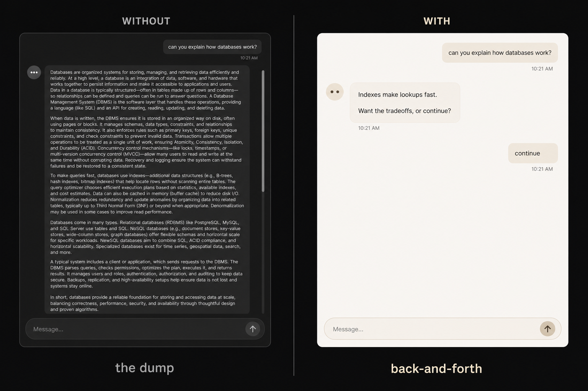
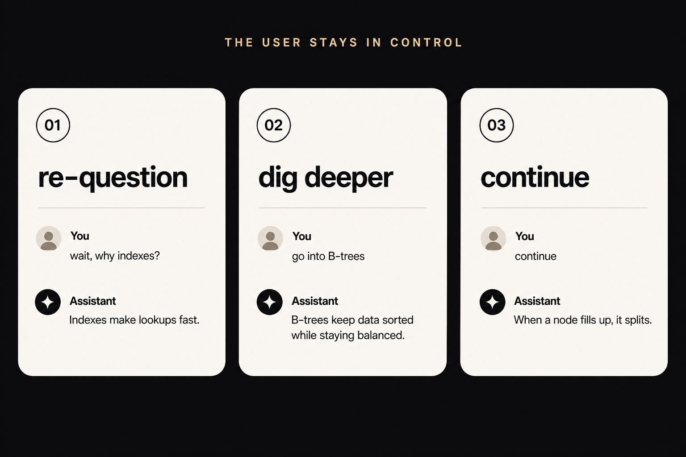

# back-and-forth

A skill that teaches agents to talk like a conversation partner instead of dumping a briefing.

[](https://skills.sh/PattoPeraltta/back-and-forth)

Follows the [Agent Skills](https://agentskills.io/) format. Works with Cursor, Claude Code, Codex, and any agent that can load `SKILL.md`.



## Why

Most agents treat a broad question as a request for the whole essay. You asked how databases work; you get ACID, indexes, replication, and a glossary before you can interrupt.

This skill flips that. One beat. Then wait. You stay in control.

**Use when:**

- Chatting, explaining, or teaching
- Walking through a large topic
- You want to re-question, dig deeper, or say `continue`
- A long answer would be better paced than dumped

## How it behaves

Keep replies short. Lead with the point. Skip preamble.

On larger topics, cover one beat, then stop. Do not dump the rest unless asked.



The user can:

| You say | The agent does |
| --- | --- |
| re-question | answers the new question, still short |
| dig deeper | goes one level down on the current beat |
| `continue` | takes the **next** beat only, still short |

`continue` is not permission to unload the rest of the outline.

## Example

```
You: how do databases work?

Agent: Indexes make lookups fast. Want the tradeoffs, or continue?

You: wait, why indexes?

Agent: Without one, the engine scans every row. With one, it jumps to the match.

You: go into B-trees

Agent: B-trees keep keys sorted and balanced so lookups stay logarithmic as the table grows.

You: continue

Agent: When a node fills up, it splits. That's how the tree stays shallow.
```

## Install

```bash
npx skills add PattoPeraltta/back-and-forth
```

Add `-g` to install globally instead of in the current project.

Once installed, the agent should pick it up when a conversation would otherwise turn into a dump. You can also name it: "use back-and-forth".

## What's in the repo

```
back-and-forth/
├── SKILL.md          # name, description, instructions
assets/               # README images
LICENSE
README.md
```

The skill itself is one short `SKILL.md`. No scripts. No extra references.

## License

[MIT](LICENSE)
